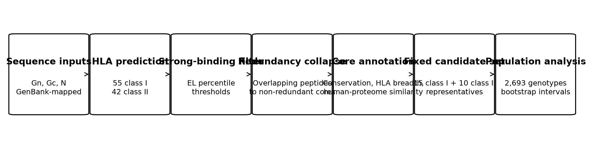
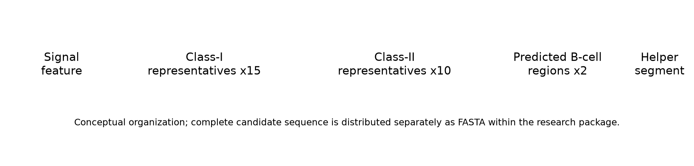
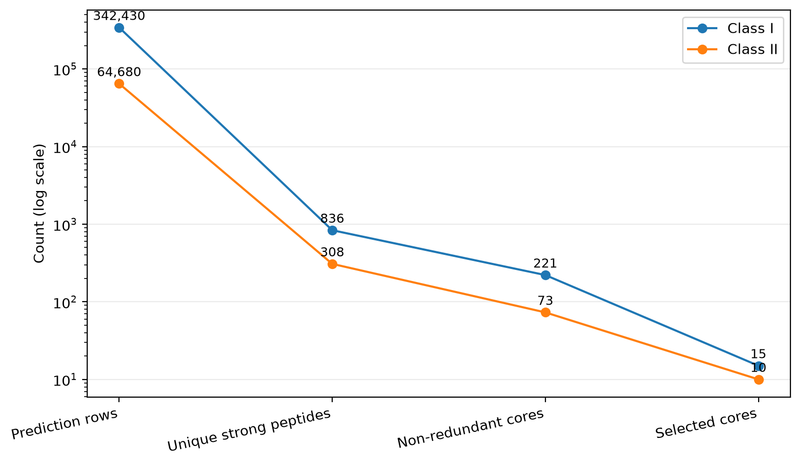
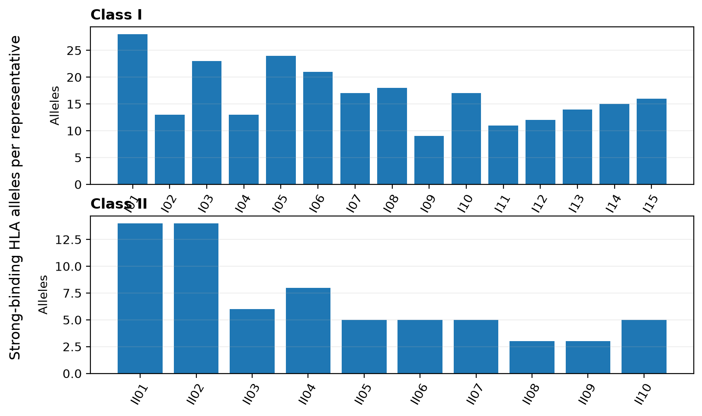
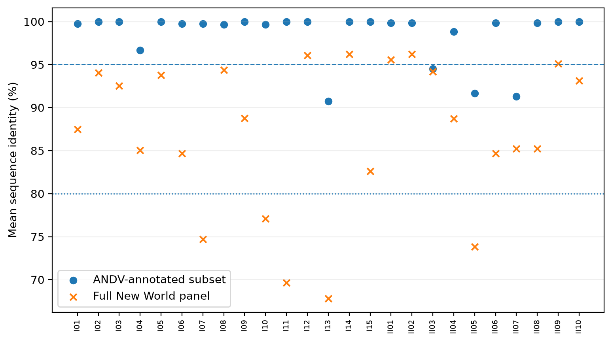
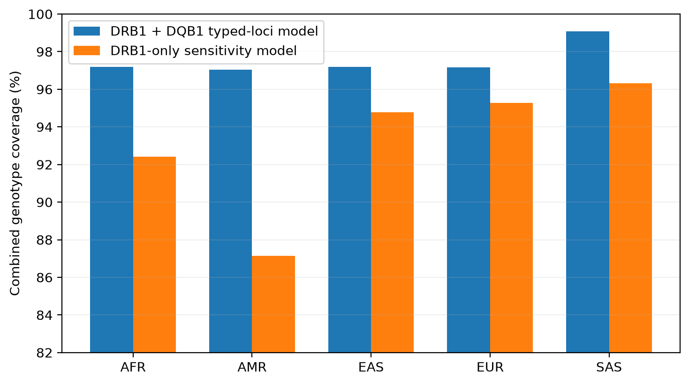

# Computational design and population-level evaluation of a multi-epitope Andes virus vaccine candidate

**Summus Stuprator**

## Abstract

Andes virus (ANDV) causes hantavirus cardiopulmonary syndrome in South America and has repeatedly demonstrated person-to-person transmission. Vaccine research has progressed from animal studies of DNA- and viral-vector approaches to a first-in-human phase 1 trial of an ANDV DNA vaccine, but there is still room for complementary approaches that explore how viral antigens might be represented across diverse human HLA backgrounds. Here, a multi-epitope ANDV vaccine candidate was designed and evaluated entirely in silico using viral sequence data, peptide-HLA prediction, conservation analysis, human-proteome sequence comparison, and genotype-based population modeling. Gn, Gc, and nucleocapsid sequences were analyzed against a panel of 55 class-I and 42 class-II HLA entries. The peptide-HLA dataset contained 342,430 class-I and 64,680 class-II prediction rows. Strong-binding filters retained 2,736 and 684 rows, corresponding to 836 unique class-I peptides and 308 unique class-II peptides. Overlapping predictions were collapsed into 221 class-I and 73 class-II local cores, which were ranked using predicted binding, HLA breadth, sequence conservation, auxiliary presentation or immunogenicity scores, broader New World hantavirus conservation, and human-proteome similarity. The candidate contains 15 class-I and 10 class-II representative peptides drawn from Gn, Gc, and nucleocapsid, together with two predicted B-cell regions and helper and signal components. Most candidate regions were highly conserved within the ANDV-annotated sequence subset. None of the selected representatives had a human-proteome match within one mismatch under the PEPMatch search used here. In 2,693 1000 Genomes HLA genotypes, estimated class-I coverage was 99.48%. Combined class-I and class-II coverage was 97.55% (95% bootstrap interval 96.96-98.11) when typed DRB1 and DQB1 information was used, and 93.50% (92.54-94.36) in a DRB1-only sensitivity analysis. The study therefore yields a defined in silico candidate with broad predicted HLA representation and a substantial accompanying dataset. Its biological performance remains to be tested experimentally. The complete computational record is released with the project so that the analysis can be inspected, reproduced, taught, and extended by other researchers and learners.

## Introduction

Andes virus (ANDV) is one of the South American orthohantaviruses associated with hantavirus cardiopulmonary syndrome (HCPS). Human infection usually follows exposure to infected rodents, but ANDV has an additional epidemiological feature that has shaped both public-health practice and vaccine research: person-to-person transmission. Molecular evidence from an outbreak in Argentina in 1996 provided the first direct genetic support for human transmission of a hantavirus [1]. More than two decades later, the 2018-2019 outbreak in Chubut Province showed how consequential that route can become. Thirty-four infections and 11 deaths were confirmed after a single zoonotic introduction, and reconstruction of the outbreak identified chains of transmission linked to close social contact [2].

The possibility of preventing severe ANDV disease has been studied for years. DNA vaccines encoding hantavirus glycoproteins elicited neutralizing antibodies in nonhuman primates [3], and antibody generated by ANDV DNA vaccination protected hamsters in passive-transfer experiments [4]. Recombinant vesicular stomatitis virus vectors expressing ANDV glycoprotein precursor also protected hamsters against lethal challenge [5]. The field reached an important clinical milestone when an ANDV DNA vaccine was evaluated in a randomized phase 1 trial involving 48 healthy adults. Neutralizing-antibody responses were detected, with several dose and schedule groups reaching seropositivity of at least 80% later in follow-up [6]. These studies establish that ANDV vaccine development is not merely theoretical; several platforms have produced measurable immune responses or protection in experimental systems.

Computational vaccine design addresses a different part of the problem. Rather than testing a delivery platform or measuring protection, it asks which parts of a viral proteome are attractive candidates for inclusion and how those choices behave under known sources of variation. HLA polymorphism is particularly important for T-cell-focused designs. A peptide predicted to bind one HLA molecule can be irrelevant to individuals who do not carry that allele, while broad population coverage requires a set of peptides whose predicted restrictions collectively span many HLA backgrounds. Viral sequence diversity adds another constraint: a highly ranked epitope from one reference sequence is less useful if the same region varies substantially among circulating viruses.

Immunoinformatics studies have already been used to propose hantavirus multi-epitope vaccines. One published whole-proteome study combined T-cell and B-cell epitope prediction with structural modeling, docking, molecular dynamics, in silico cloning, and immune simulation [7]. Such studies demonstrate the range of computational tools available, but they also illustrate a recurring difficulty. Large prediction pipelines can generate impressive quantities of output without making clear which numbers describe independent candidate regions, which refer to overlapping peptide windows, and which are properties of the exact sequence that would actually be carried forward.

That distinction matters because peptide-HLA scans are intrinsically redundant. An 8-11-residue class-I scan and a 15-residue class-II scan produce overlapping windows across the same protein. Each peptide is then evaluated against many HLA molecules. A local region with strong predicted binding can therefore create dozens or hundreds of favorable peptide-allele rows even when those rows arise from only a few closely related sequences. Counting every favorable row as a separate candidate would greatly exaggerate the diversity of the search space.

The three proteins used here also represent different aspects of the viral proteome. Gn and Gc are produced from the glycoprotein precursor and form the viral envelope machinery exposed during entry, whereas nucleocapsid is an internal structural protein encoded by the S segment. A multi-antigen design can therefore draw T-cell targets from proteins under different functional and evolutionary pressures rather than relying on one sequence alone. The present candidate does not assume that all three antigens contribute equally; instead, their peptide windows enter the same computational selection framework and are retained according to the same scoring rules.

For T-cell vaccine design, the relevant unit is not simply a viral protein but a peptide presented by a particular HLA molecule. Class-I HLA molecules generally present shorter peptides to CD8 T cells, while class-II molecules present longer peptides to CD4 T cells. The extraordinary polymorphism of HLA genes means that a sequence with excellent predicted binding to one allele may have little population value by itself. This is why the study uses both class-I and class-II panels and why HLA breadth is treated as a property to be measured rather than assumed.

The present study was organized around that problem. Peptide-level predictions were first reduced to unique sequences and then collapsed into local cores. Those cores were characterized by predicted HLA binding, allele breadth, conservation within ANDV, conservation across a broader New World hantavirus sequence collection, auxiliary prediction scores, and short-sequence similarity to the human proteome. A representative peptide from each selected core was then carried forward into population analysis. This last step is important: the allele breadth of a local core can be larger than the breadth of any single peptide inside it, so candidate-level population coverage should follow the selected representative rather than inherit every HLA relationship observed anywhere in the surrounding core.

The population analysis used observed HLA genotypes from 2,693 individuals in the 1000 Genomes panel [8,9]. This allowed coverage to be counted directly at the individual level instead of being inferred only from single-allele frequencies. The available HLA data include A, B, C, DRB1, and DQB1. Because class-II prediction panels often contain additional DR, DQ, and DP combinations, coverage was evaluated under two interpretations: a conservative DRB1-only calculation and a broader typed-loci calculation that also used observed DQB1 beta chains for predicted DQ restrictions.

Conservation and human-proteome similarity were analyzed alongside HLA binding rather than treated as post hoc decorations. The conservation dataset contains 107 glycoprotein-precursor and 122 nucleocapsid sequences, including an ANDV-annotated subset and additional New World hantavirus records. Human-proteome comparison was performed with PEPMatch and used as a sequence-screening term during ranking. B-cell prediction and sequence-derived physicochemical descriptors were retained as secondary components of the candidate description.

The result is an in silico vaccine candidate: a specific computational design with a defined set of peptide components and a corresponding body of predicted evidence. It has not been tested in cell culture, animals, or humans as an assembled candidate. That distinction is simple but important. The value of the present work lies in defining the design carefully enough that subsequent studies can test it, disagree with it, reproduce it, or replace parts of the analysis with better data.

The accompanying `andv-vaccine` project is organized as a public research package. It contains the sequence files, peptide-level and core-level results, HLA and population inputs, conservation data, figure source data, analysis code, and the complete candidate sequence. Besides supporting scientific scrutiny, an openly organized dataset can be useful to students, independent researchers, and technically interested readers who want to see how a real immunoinformatics project moves from viral proteins to a candidate and a paper.

The study had four main aims: to define the peptide-HLA prediction landscape of the selected ANDV antigens; to reduce overlapping predictions to a tractable set of local regions; to characterize and select a multi-epitope candidate using conservation, HLA breadth, and sequence-similarity information; and to estimate how widely the selected representative peptides are covered in observed human HLA genotypes.

# Methods

## Study overview

The analysis used ANDV Gn, Gc, and nucleocapsid proteins as the antigenic search space. Figure 1 summarizes the workflow. Protein sequences were paired with an HLA panel, peptide-HLA predictions were generated through the IEDB next-generation service, strong-binding peptides were collapsed into local cores, and those cores were annotated and ranked. The selected representatives were then evaluated for conservation, human-proteome sequence similarity, HLA breadth, and genotype-based population coverage. B-cell prediction and aggregate sequence descriptors were analyzed as secondary layers.

**Figure 1. Computational workflow.** Sequence inputs and the HLA panel define the peptide-HLA search space. Strong-binding predictions are reduced to unique peptides and local cores, which are annotated and ranked before representative-level population analysis.

## Viral sequence data

The analysis used Gn and Gc sequences derived from the ANDV glycoprotein precursor record MN258217.1 and a nucleocapsid sequence corresponding to MN258242.1. Mature Gn and Gc map to residues 31-500 and 501-1138 of the glycoprotein precursor, respectively. The nucleocapsid sequence is 428 amino acids long.

The stored Gn and Gc analysis records contain an engineered N-terminal signal segment used in the computational candidate record. Because the peptide scan was run over the stored analysis sequences, the raw prediction tables contain peptides that lie within or cross this non-native segment. These rows remain part of the complete prediction dataset, but signal-overlapping cores were removed before candidate selection. Native viral coordinates were used for conservation analysis.

For conservation, GenBank records were collected for glycoprotein precursor and nucleocapsid proteins from ANDV and related New World hantaviruses. The final dataset contains 107 glycoprotein-precursor sequences and 122 nucleocapsid sequences. Twenty-five glycoprotein and 23 nucleocapsid records were annotated as ANDV and were analyzed separately from the broader New World set. Glycoprotein and nucleocapsid sequences were aligned independently with MAFFT using the `--auto` strategy [14].

## HLA panel and population genotype data

The peptide-prediction panel contains 55 class-I and 42 class-II HLA entries. Class I consists of 18 HLA-A, 20 HLA-B, and 17 HLA-C alleles. Class II consists of 21 DRB1 alleles, four DRB3/4/5 entries, 12 DQ heterodimers, and five DP heterodimers. The panel was assembled from HLA-frequency information with representation from the five 1000 Genomes superpopulations.

Individual-level population analysis used the 2,693-sample HLA dataset described by Abi-Rached and colleagues [9]. The source panel includes HLA-A, HLA-B, HLA-C, HLA-DRB1, and HLA-DQB1 genotypes and spans the AFR, AMR, EAS, EUR, and SAS superpopulation groups of the 1000 Genomes Project [8,9].

**Table 1. HLA data used for peptide prediction and genotype coverage.**

| Component | Prediction panel | Available in genotype panel | Population analysis |
|---|---:|---:|---|
| HLA-A | 18 alleles | Yes | Direct class-I matching |
| HLA-B | 20 alleles | Yes | Direct class-I matching |
| HLA-C | 17 alleles | Yes | Direct class-I matching |
| HLA-DRB1 | 21 alleles | Yes | Direct class-II matching |
| DRB3/4/5 | 4 entries | No | Not counted |
| DQ heterodimers | 12 entries | DQB1 only | DQB1 used in broader model |
| DP heterodimers | 5 entries | No | Not counted |

## Peptide-HLA prediction

Predictions were retrieved through the IEDB next-generation API on August 12, 2026 [22]. Class-I peptides were 8-11 residues long and were evaluated with NetMHCpan-family outputs together with MHCflurry and the IEDB class-I immunogenicity score [10-12]. The class-II scan used 15-residue peptides with NetMHCIIpan-family outputs and CD4Episcore [10,13]. The API records identify the method families used for the analysis; exact served predictor-version identifiers were not returned in the archived responses.

Strong-binding rows were defined from the eluted-ligand percentile output. The threshold was <0.5 for class I and <2.0 for class II. These filters were applied before redundancy reduction.

The complete dataset consists of four class-I and four class-II prediction tables. Together they contain 342,430 class-I and 64,680 class-II peptide-allele rows. Each row records the peptide, antigen source and coordinates, HLA target, and the available prediction fields for that method family.

## Reducing overlapping predictions to local cores

Strong-binding rows were first reduced to one record per unique peptide. For each peptide, the analysis retained its source protein, coordinates, strong-binding HLA set, best EL percentile, and auxiliary prediction values.

Peptides were clustered separately within Gn, Gc, and nucleocapsid. Unique strong-binding peptides were ordered by decreasing number of strong-binding HLA entries, then by better EL percentile and sequence position. The highest-ranked unassigned peptide became the seed of a core. Another peptide was assigned to that core when its coordinate overlap with the seed covered at least 60% of the shorter peptide. The seed became the representative peptide for the core, while the core boundaries covered the full span of its member peptides.

This produces two related but different descriptions of a region. Core-level HLA breadth is the union of strong-binding alleles across overlapping member peptides. Representative-level breadth contains only predictions made for the representative peptide itself. Core-level quantities were used to describe and rank local regions; representative-level allele sets were used when the final candidate was evaluated against human genotypes.

## Conservation analysis

For each position in the aligned viral sequence panels, conservation was calculated as the fraction of covering sequences identical to the ANDV reference residue. Shannon entropy was also calculated as a measure of local sequence variability. Core-level conservation was summarized across the residues spanned by each core.

Two sequence scopes were retained. The ANDV-annotated subset measures variation among records explicitly annotated as ANDV. The broader New World set provides a more heterogeneous comparison across related hantavirus sequences. Results are summarized using mean identity thresholds of 95% for the ANDV subset and 80% for the broader panel. These thresholds were used as descriptive cutoffs for organizing the candidate space.

## Human-proteome sequence comparison

All unique strong-binding peptides were compared with the human proteome using PEPMatch through the IEDB next-generation service [15]. Searches allowed up to one mismatch and retained the best available result for each peptide. Peptides were grouped as exact matches, one-mismatch matches, or no match within the search criterion.

A core containing an exact-match peptide was excluded from selection. A one-mismatch result contributed a penalty to the human-similarity component of the core score. The representative peptide was also tracked separately, which allowed the sequence-similarity status of the final carried peptide to be distinguished from that of neighboring peptides in the same core.

## Core ranking and candidate selection

Each non-redundant core received a composite score from six quantities: predicted binding, HLA breadth, conservation in the ANDV subset, a class-specific auxiliary prediction, conservation across the full New World panel, and the human-proteome comparison. The weights are shown in Table 2.

For class I, the auxiliary prediction was based on MHCflurry processing output. For class II, the auxiliary term was derived from CD4Episcore. Binding was scaled from the best EL percentile relative to the strong-binding threshold, and HLA breadth was normalized within each class. Cores with exact human-proteome matches or overlap with the engineered signal region were removed before ranking.

The purpose of the composite score was not to convert several predictors into a single biological truth. It was a ranking device for a large candidate space. Binding strength received the largest weight because the pipeline began with an HLA-presentation question; breadth and ANDV conservation then favored regions that were predicted to work across more of the study panel and that were stable in the available viral sequences. The smaller auxiliary, broader-conservation, and sequence-similarity terms were used to separate otherwise similar cores. Keeping the individual component values in the result tables allows the final ranking to be unpacked later rather than treated as a black-box score.

The candidate design specified 15 class-I and 10 class-II representatives. Eligible cores were ordered by composite score, and the top-ranked representatives in each class were carried forward.

The 15+10 structure was chosen to keep the T-cell component finite while retaining representation from multiple antigens and many HLA restrictions. It should be read as a concrete design choice rather than as a mathematical optimum. A smaller set would be easier to describe but could discard useful HLA relationships; a much larger set would retain more candidates but would blur the distinction between discovery output and a defined vaccine concept. The selected size therefore serves the practical purpose of turning the ranked search space into one candidate that can be evaluated consistently across the downstream analyses.
 Candidate-level HLA coverage was calculated from the representative peptides rather than from the full allele union of their surrounding cores.

**Table 2. Composite score used to rank non-redundant cores.**

| Term | Weight | Input |
|---|---:|---|
| Predicted binding | 0.30 | Best EL-percentile performance |
| HLA breadth | 0.25 | Strong-binding HLA count, normalized within class |
| ANDV conservation | 0.20 | Mean identity in ANDV-annotated records |
| Auxiliary prediction | 0.10 | MHCflurry processing for class I; CD4Episcore for class II |
| New World conservation | 0.10 | Mean identity across broader sequence panel |
| Human-proteome similarity | 0.05 | Penalty for one-mismatch result; exact match excluded |

## Genotype-based population coverage

Population coverage was calculated directly from the selected representative peptides and the 2,693 individual HLA genotypes. For class I, a person was counted as covered when at least one typed HLA-A, HLA-B, or HLA-C allele appeared in the strong-binding set of at least one selected class-I representative.

Class-II coverage was calculated under two models. The conservative model used only directly typed HLA-DRB1 restrictions. The broader typed-loci model also matched the DQB1 beta chain of predicted DQ heterodimers to the observed DQB1 genotype. DQA1 was not available in the source genotype table. DP and DRB3/4/5 predictions were therefore not counted in either model.

Combined coverage required both class-I and class-II coverage in the same individual. Percentages were calculated for the complete panel and separately for AFR, AMR, EAS, EUR, and SAS. Uncertainty in the overall combined percentage was summarized with 2,000 bootstrap resamples of individuals. This individual-genotype approach follows the same general idea as epitope-HLA population-coverage models [16], but retains the observed multi-locus genotypes rather than reconstructing them from marginal allele frequencies.

## B-cell predictions and candidate-level descriptors

B-cell analyses were treated as a secondary part of the design. Archived BepiPred-3.0 output was used to identify contiguous predicted linear regions of at least five residues [17]. Archived DiscoTope-3.0 output for Gn and Gc was summarized using the stored epitope assignment and solvent-accessibility fields [18]. Two regions were retained as predicted B-cell components in the candidate record.

The complete candidate contains the 15 class-I representatives, 10 class-II representatives, two predicted B-cell regions, a helper component, and an N-terminal signal feature. Its total length is 460 amino acids. Molecular mass, theoretical isoelectric point, instability index, grand average of hydropathy (GRAVY), and aliphatic index were calculated from the full amino-acid sequence using Biopython and standard sequence-based formulas [19-21]. Figure 6 shows the component-level organization without printing the sequence in the figure itself.

**Figure 6. Candidate architecture.** Component-level organization of the 460-residue in silico candidate. The complete amino-acid sequence is part of the companion data release.

## Data organization

The computational study is distributed with a companion `andv-vaccine` research package. The public package contains the input FASTA files, complete candidate sequence, HLA panel, 1000 Genomes genotype table, conservation panels, peptide-level prediction tables, core and selected-representative tables, human-proteome comparison results, population-coverage output, B-cell prediction tables, figure source data, and the analysis code used for the reported downstream calculations. Large prediction tables are distributed as release assets or a linked archival dataset when repository size makes direct Git storage impractical.

# Results

## The peptide-HLA search space

The class-I scan produced 342,430 peptide-allele rows and the class-II scan produced 64,680, for 407,110 prediction rows in total. Applying the EL-percentile filters retained 2,736 class-I strong-binding rows and 684 class-II strong-binding rows. Once repeated HLA evaluations were collapsed to unique sequences, the strong-binding subset contained 836 class-I peptides and 308 class-II peptides.

The strong-binding rows represented 0.80% of the class-I peptide-allele table and 1.06% of the class-II table. These percentages are small, but the remaining rows are still highly redundant because the same favorable peptide can bind several HLA molecules and adjacent windows can describe the same local sequence feature. The reduction to unique peptides and then to local cores was therefore central to the interpretation of the scan, not merely a file-size reduction.

Some predictions arise from the engineered N-terminal segment present in the stored Gn and Gc records. Twenty-seven unique class-I strong-binding peptides and 11 unique class-II strong-binding peptides touched stored positions 1-23. These regions were removed from the candidate pool before ranking.

The scale of the raw tables is therefore not the scale of the biological search space. Most rows are repeated evaluations of the same peptide against different HLA molecules, and many unique peptides overlap one another in the viral sequence.

## Redundancy collapse reduces hundreds of peptides to local regions

The 836 unique class-I strong-binding peptides collapsed to 221 non-redundant cores. Gc contributed 89 class-I cores, Gn 69, and nucleocapsid 63. The 308 unique class-II peptides collapsed to 73 cores: 30 from nucleocapsid, 22 from Gc, and 21 from Gn.

Figure 2 shows the reduction from raw peptide-HLA rows to unique strong-binding peptides, local cores, and selected representatives. The change is substantial. Class-I analysis moves from more than 340,000 rows to 221 local regions; class II moves from almost 65,000 rows to 73. This is the level at which the subsequent ranking becomes interpretable.

Numerically, the collapse removed about three quarters of the unique strong-binding sequences as independent candidate units: 836 class-I peptides became 221 cores and 308 class-II peptides became 73. This does not mean that the discarded overlapping peptides were uninformative. Their HLA restrictions and auxiliary scores remain part of the core record, but the local region becomes the unit used for ranking and visualization. That choice makes the scale of the result easier to understand and prevents one dense prediction hotspot from appearing as dozens of unrelated vaccine targets.

**Figure 2. Reduction of the prediction space.** Peptide-HLA rows are reduced to unique strong-binding peptides, non-redundant cores, and the selected representative set.

**Table 3. Prediction and reduction summary.**

| Metric | Class I | Class II |
|---|---:|---:|
| Peptide-HLA prediction rows | 342,430 | 64,680 |
| Strong-binding rows | 2,736 | 684 |
| Unique strong-binding peptides | 836 | 308 |
| Non-redundant cores | 221 | 73 |
| Selected representatives | 15 | 10 |

## Composition and HLA breadth of the selected representatives

The selected class-I set contains five representatives from Gn, five from Gc, and five from nucleocapsid. The class-II set contains three from Gn, one from Gc, and six from nucleocapsid. This gives all three analyzed antigens representation in the final T-cell component, although the class-II distribution is weighted toward nucleocapsid.

The antigen distribution also shows that the final set was not dominated by a single protein. Class-I selection was exactly balanced across Gn, Gc, and nucleocapsid, whereas the class-II set favored nucleocapsid. That pattern emerged from the ranking rather than from an antigen-specific quota for class II. In practical terms, the candidate therefore combines envelope-derived and internal-protein-derived T-cell targets, which may be useful when future experimental studies ask whether responses are distributed across several viral proteins or concentrated in a few regions.

At the core level, the selected class-I regions were associated with 19-37 strong-binding HLA alleles, with a median of 28. Selected class-II cores were associated with 5-17 entries, with a median of 8. The exact representative peptides were narrower: class-I representatives bound 9-28 panel alleles each (median 16), while class-II representatives bound 3-14 panel entries (median 5).

Figure 4 displays representative-level HLA breadth. The reduction from core breadth to representative breadth is not an error in the clustering; it reflects the fact that neighboring overlapping peptides can have different HLA restrictions. A local region can therefore accumulate more total HLA relationships than any one sequence inside it.

**Figure 4. HLA breadth of selected representative peptides.** Bars count the strong-binding HLA entries predicted for the representative peptide carried into the candidate.

## Conservation across ANDV and related New World hantaviruses

Conservation was high for most cores in the ANDV-annotated subset. Two hundred of 221 class-I cores (90.5%) had mean identity of at least 95%, as did 62 of 73 class-II cores (84.9%). Across the more heterogeneous New World panel, 177 class-I cores (80.1%) and 60 class-II cores (82.2%) had mean identity of at least 80%.

The selected regions followed the same pattern. Within the ANDV subset, class-I core mean identity ranged from 90.76% to 100%, with a median of 100%. Class-II core identity ranged from 91.29% to 100%, with a median of 99.82%. Across the broader panel, selected class-I core means ranged from 67.83% to 96.19%, while class-II means ranged from 73.81% to 96.19%.

Figure 3 makes the difference between the two sequence scopes visible. The ANDV-annotated points cluster near complete identity, whereas the broader New World set spreads downward for several regions. That distinction is useful: conservation within ANDV and conservation across related hantaviruses are different questions and need not produce the same ranking.

**Figure 3. Conservation of selected cores.** Mean identity is shown for the ANDV-annotated subset and the complete New World sequence panel. Reference lines mark 95% and 80% identity.

## Human-proteome sequence comparison

PEPMatch results were available for all 836 unique class-I strong-binding peptides. One peptide had an exact match in the human proteome, 31 had a one-mismatch best match, and 804 had no match within one mismatch. The core containing the exact match was excluded before selection.

All 308 unique class-II strong-binding peptides returned no match within one mismatch under the same search. None of the 25 selected representative peptides had a match within one mismatch. One selected class-I core contains a neighboring, non-representative peptide with a one-mismatch result, which affected the ranking score for that core but not the sequence status of the selected representative itself.

The comparison is a simple sequence-level screen, but it adds information that HLA binding and conservation do not provide. It also illustrates why storing peptide-level results remains useful after local clustering: a property observed in one member of a core is not necessarily a property of the representative sequence.

## Genotype-based population coverage

Class-I coverage was high across the 2,693-sample genotype panel. At least one selected class-I representative was predicted to bind one of the observed HLA-A, HLA-B, or HLA-C alleles in 99.48% of individuals.

Class-II estimates were more sensitive to the available genotype information. Using DRB1 alone, class-II coverage was 93.95%. When the typed DQB1 beta chain was also used to credit predicted DQ restrictions, class-II coverage rose to 97.99%. Combined class-I and class-II coverage was therefore 93.50% in the DRB1-only analysis and 97.55% in the broader typed-loci analysis. The corresponding 95% bootstrap intervals were 92.54-94.36 and 96.96-98.11.

Coverage remained high in each of the five 1000 Genomes superpopulations under the broader model: 97.19% in AFR, 97.05% in AMR, 97.20% in EAS, 97.16% in EUR, and 99.08% in SAS. The DRB1-only estimates were 92.42%, 87.13%, 94.78%, 95.27%, and 96.32%, respectively. AMR showed the largest difference between the two class-II interpretations.

**Figure 5. Combined genotype-model coverage by 1000 Genomes superpopulation.** The broader calculation uses observed DRB1 and DQB1 information; the sensitivity analysis uses DRB1 only.

**Table 4. Overall genotype coverage of the selected representative peptides.**

| Model | Class I | Class II | Combined | 95% bootstrap interval for combined |
|---|---:|---:|---:|---:|
| DRB1 + DQB1 typed-loci analysis | 99.48% | 97.99% | 97.55% | 96.96-98.11% |
| DRB1-only analysis | 99.48% | 93.95% | 93.50% | 92.54-94.36% |

The difference between the two coverage models is visible even though both overall percentages are high. The DRB1-only analysis asks a narrower question using only an observed alpha-independent class-II locus. The broader calculation uses more of the available genotype table by allowing a typed DQB1 beta chain to support predicted DQ restrictions, but the paired DQA1 chain is not observed. Reporting both results avoids forcing that choice into a single percentage. For the present candidate, the interval between 93.50% and 97.55% is more informative than either number in isolation.

The two class-II calculations are best viewed as a range tied to the information present in the source HLA table. The broader estimate uses more of the available typed loci, while the DRB1-only result avoids assigning DQ presentation from an observed beta chain without a matched DQA1 genotype.

## B-cell annotations and aggregate candidate properties

BepiPred-3.0 identified five contiguous predicted linear regions of at least five residues in Gn and 12 in nucleocapsid. No Gc region met that post-processing definition in the archived BepiPred output. The archived DiscoTope tables contained 108 Gn residues and 134 Gc residues meeting the stored epitope-assignment and solvent-accessibility criteria used in the downstream summary.

Two regions were retained as predicted B-cell components in the complete candidate. One corresponds to a BepiPred-positive Gn region; the other is supported by the archived Gc DiscoTope analysis and overlaps a selected class-II region. These components are secondary to the T-cell analysis in the present study, but they form part of the final candidate record.

The complete amino-acid candidate is 460 residues long with a calculated molecular mass of 48.72 kDa. Its theoretical pI is 6.56, instability index 24.46, GRAVY -0.247, and aliphatic index 68.24. These descriptors summarize the sequence as a whole and are included alongside the complete sequence in the research release.

# Discussion

The analysis produced a specific multi-epitope ANDV candidate from a large peptide-HLA search space and then tested the design against sequence conservation, human-proteome similarity, and observed HLA genotypes. The most obvious result is the scale reduction. More than 407,000 peptide-allele rows ultimately describe 294 non-redundant local cores. The final T-cell component contains 25 representatives. This is a useful reminder that the apparent size of an immunoinformatics dataset can be driven more by sliding windows and repeated HLA evaluations than by the number of distinct viral regions under consideration.

The distinction between a core and its representative peptide became one of the more informative parts of the study. A core is useful for discovering local regions because nearby overlapping peptides can contribute complementary HLA restrictions. The final candidate, however, contains particular sequences. When population coverage is calculated, the selected representative should receive only the HLA relationships predicted for that sequence. In this dataset, representative-level breadth was noticeably lower than core-level breadth, although it remained substantial: the median selected class-I representative bound 16 of 55 class-I panel alleles, and the median class-II representative bound five class-II entries.

That difference carries into the population model. Even after coverage was tied directly to the selected representative peptides, class-I coverage remained 99.48% in the 2,693 1000 Genomes genotypes. The combined estimate was 97.55% when observed DQB1 information was used in addition to DRB1 and 93.50% when class II was restricted to DRB1. The gap is scientifically useful rather than inconvenient. It shows where the strongest population-level uncertainty lies: not in class I, which is almost saturated in this panel, but in how incompletely typed class-II heterodimers are represented in the available genotype data.

The superpopulation results reinforce that point. Under the broader typed-loci model, combined coverage varied little across AFR, AMR, EAS, EUR, and SAS. Under the DRB1-only calculation, the estimates spread more widely, with the largest drop in AMR. This should motivate better HLA data rather than a stronger claim from the same dataset. A genotype resource with paired DQA1/DQB1 information and more complete DP and secondary DR typing would allow the class-II part of the candidate to be evaluated with fewer assumptions.

Conservation provides a different kind of evidence. Most class-I and class-II cores were highly conserved among records annotated as ANDV, and the selected set had median mean identity near 100% in that subset. The broader New World panel was more variable, which is not surprising given its larger taxonomic spread. These two views should not be collapsed into a single idea of “conserved.” A region can be very stable within sampled ANDV sequences while diverging more strongly among related hantaviruses. For an ANDV-focused candidate, the first quantity is the more direct one; the broader panel is useful as an additional description of sequence context.

The human-proteome comparison removed one class-I core because one of its peptides had an exact sequence match. Thirty-one other class-I peptides had one-mismatch matches, but none of the selected representatives did. This is not a substitute for experimental safety assessment, and it was not used as one. Its practical value here is narrower: it provides a transparent sequence-screening step that can be rerun when the peptide set or reference proteome changes.

The B-cell component deserves a more modest place in the interpretation. The archived BepiPred and DiscoTope outputs provide predicted linear and structure-informed annotations, and two regions were retained in the candidate. However, the T-cell and population analyses are much better supported by the retained data. The source structures used in the archived DiscoTope runs were not preserved, so a future structural analysis should be treated as a new analysis rather than as a simple rerun. For that reason, the B-cell results are best viewed as candidate annotations rather than one of the main quantitative findings of the paper.

The candidate also has straightforward sequence-level properties: 460 amino acids, a calculated mass of 48.72 kDa, pI 6.56, GRAVY -0.247, instability index 24.46, and aliphatic index 68.24. These quantities are useful for describing the design, but their real value will come when they can be compared with experimental behavior. A low calculated instability index, for example, is a sequence-derived descriptor rather than evidence that the complete candidate will express, fold, or remain stable under experimental conditions.

Seen in the context of earlier ANDV vaccine research, this computational candidate occupies a different stage of the development chain. The nonhuman-primate DNA-vaccine work demonstrated that ANDV glycoprotein immunogens can elicit neutralizing antibodies [3]. Passive transfer showed that vaccine-derived antibody can protect in the hamster model [4], and VSV-vector studies demonstrated direct vaccine protection in the same model [5]. The phase 1 trial then established that an ANDV DNA vaccine can be administered to humans and produce neutralizing responses [6]. Those results provide biological evidence for the tractability of ANDV vaccination. The present study instead asks how a multi-epitope T-cell-oriented design might be constructed across HLA diversity and viral sequence variation.

That difference in stage is important because computational and experimental vaccine studies can complement one another without answering the same question. Experimental platforms tell us whether an immunogen can be delivered, expressed, tolerated, and recognized by the immune system. Immunoinformatics can search a much larger sequence and HLA space than would be practical to test one peptide at a time. The strongest use of the computational approach is therefore to narrow and organize hypotheses before experimental work, while retaining enough underlying data that investigators can understand why each region was chosen.

The study sits alongside rather than in competition with experimental ANDV vaccine development. DNA vaccination has produced neutralizing responses in nonhuman primates [3], vaccine-derived immune serum protected hamsters [4], VSV-based vaccination protected hamsters against lethal challenge [5], and a DNA vaccine has now produced neutralizing-antibody responses in a phase 1 human trial [6]. Those studies answer questions that this work cannot answer. The contribution here is upstream: a transparent attempt to define a broad T-cell-focused multi-epitope candidate and quantify the assumptions behind it before experimental testing.

Previous hantavirus immunoinformatics work has explored broad combinations of epitope prediction, structural modeling, receptor docking, molecular dynamics, in silico cloning, and immune simulation [7]. The present analysis takes a somewhat different route. Its strongest evidence comes from peptide-level HLA prediction, overlap reduction, viral conservation, human-sequence comparison, and observed HLA genotypes. The resulting design is less dependent on simulated downstream biology and more directly linked to data that can be inspected row by row.

An open release is useful in this setting because computational vaccine papers can otherwise be difficult to interrogate. A reader may see a final candidate and a list of impressive percentages without access to the thousands of rows that produced them. The companion repository is intended to expose that intermediate structure: sequences, raw predictions, selected and rejected regions, population inputs, analysis code, and figure data. Researchers can repeat the calculations or substitute their own methods. Students and independent learners can follow the same materials to understand how HLA prediction, conservation analysis, and population genetics interact in an actual vaccine-design project. The value of that openness is practical rather than ceremonial; it makes the work easier to check and easier to learn from.

The educational value of such a release is also worth stating plainly. Immunoinformatics papers often present the final construct after a long chain of web-server outputs, leaving a new student with little sense of how the pieces connect. A repository that contains the FASTA inputs, raw predictions, reduced core tables, coverage code, and figure data allows the workflow to be followed in reverse or reproduced step by step. That makes the project useful not only to specialists but also to students, independent researchers, and technically curious hobbyists who want to understand how computational vaccine research is actually organized. The same openness makes mistakes easier to find, which is a feature rather than a drawback for a computational project.

There are several clear limitations. The candidate itself has not been tested experimentally. Predicted peptide-HLA binding is only one step in antigen presentation, and presentation is only one part of a T-cell response. The population model depends on the composition of the HLA prediction panel and on a 1000 Genomes genotype table that is incomplete for several class-II loci. The conservation analysis depends on the sequence records available in GenBank, which are uneven across places and time. PEPMatch evaluates short sequence identity, not immune tolerance. The structural provenance of the archived DiscoTope analysis is incomplete. Finally, the choice of 15 class-I and 10 class-II representatives is part of the design; the study did not establish that this exact component count is globally optimal.

These limitations point directly to the next research steps. The most important work is experimental. Presentation and T-cell recognition studies could test whether the selected peptides behave as predicted, and candidate-level studies could then evaluate the assembled design as a whole. In parallel, the computational analysis can improve as more complete HLA genotype resources and additional ANDV sequences become available. The open dataset should also make independent reanalysis straightforward: different clustering rules, ranking schemes, or coverage models can be compared against the same starting predictions without having to reconstruct the entire project.

There is also room for computational follow-up that does not require changing the candidate immediately. New GenBank records can be added to the conservation panel to see whether the selected regions remain stable as sampling improves. More complete HLA datasets could replace the current class-II sensitivity range with directly observed DQ and DP genotypes. Independent groups could rerun the same peptide tables with different clustering or ranking methods and ask whether broadly similar regions recur. Agreement across independent analyses would strengthen confidence in the computational priorities; disagreement would identify the parts of the design that are most method-dependent.

This is where an in silico candidate is most useful. It turns a broad idea - “design a multi-epitope ANDV vaccine” - into a finite object with explicit components and measurable predictions. It is not the end of vaccine development, but it is a testable starting point.

# Conclusion

A peptide-HLA analysis of ANDV Gn, Gc, and nucleocapsid reduced 407,110 prediction rows to 294 non-redundant local cores and a 25-representative T-cell candidate. Most selected regions were highly conserved in the ANDV-annotated sequence subset, none of the selected representatives had a human-proteome match within one mismatch under the PEPMatch search, and representative-level genotype coverage remained high after class-I and class-II predictions were mapped onto 2,693 observed HLA genotypes. Combined coverage was 97.55% in the broader DRB1+DQB1 analysis and 93.50% when class II was restricted to DRB1.

The candidate is a substantial computational design, not a validated vaccine. Its next meaningful tests are biological. By releasing the sequence, input data, prediction tables, analysis code, and derived results together, the project can also serve a second purpose: giving other researchers and learners a complete example that can be inspected, challenged, and built upon as work toward better hantavirus vaccines continues.

# Data and code availability

The companion `andv-vaccine` research release contains the viral and candidate FASTA files, complete candidate amino-acid sequence, HLA prediction panel, individual-level HLA genotype data used for coverage analysis, conservation sequence panels and accession manifests, peptide-HLA prediction tables, core and selected-representative tables, human-proteome comparison results, population-coverage outputs, B-cell prediction tables, figure-generation code, and machine-readable source data for the figures. Large prediction tables may be distributed as release assets or an archival data object linked from the repository.

# Ethics statement

This computational study used publicly available viral sequence records and a previously published HLA genotype dataset. No new human participants, clinical specimens, or animals were enrolled or collected.

# References

1. Padula PJ, Edelstein A, Miguel SD, López NM, Rossi CM, Rabinovich RD. Hantavirus pulmonary syndrome outbreak in Argentina: molecular evidence for person-to-person transmission of Andes virus. *Virology.* 1998;241:323-330. doi:10.1006/viro.1997.8976.

2. Martínez VP, Di Paola N, Alonso DO, et al. “Super-spreaders” and person-to-person transmission of Andes virus in Argentina. *N Engl J Med.* 2020;383:2230-2241. doi:10.1056/NEJMoa2009040.

3. Hooper JW, Custer DM, Smith J, Wahl-Jensen V. Hantaan/Andes virus DNA vaccine elicits a broadly cross-reactive neutralizing antibody response in nonhuman primates. *Virology.* 2006;347:208-216. doi:10.1016/j.virol.2005.11.035.

4. Hooper JW, Ferro AM, Wahl-Jensen V. Immune serum produced by DNA vaccination protects hamsters against lethal respiratory challenge with Andes virus. *J Virol.* 2008;82:1332-1338. doi:10.1128/JVI.01822-07.

5. Brown KS, Safronetz D, Marzi A, Ebihara H, Feldmann H. Vesicular stomatitis virus-based vaccine protects hamsters against lethal challenge with Andes virus. *J Virol.* 2011;85:12781-12791. doi:10.1128/JVI.00794-11.

6. Paulsen GC, Frenck R Jr, Tomashek KM, et al. Safety and immunogenicity of an Andes virus DNA vaccine by needle-free injection: a randomized, controlled phase 1 study. *J Infect Dis.* 2024;229:30-38. doi:10.1093/infdis/jiad235.

7. Abdulla F, Nain Z, Hossain MM, Syed SB, Khan MSA, Adhikari UK. A comprehensive screening of the whole proteome of hantavirus and designing a multi-epitope subunit vaccine for cross-protection against hantavirus: structural vaccinology and immunoinformatics study. *Microb Pathog.* 2021;150:104705. doi:10.1016/j.micpath.2020.104705.

8. 1000 Genomes Project Consortium. A global reference for human genetic variation. *Nature.* 2015;526:68-74. doi:10.1038/nature15393.

9. Abi-Rached L, Gouret P, Yeh J-H, Di Cristofaro J, Pontarotti P, Picard C, Paganini J. Immune diversity sheds light on missing variation in worldwide genetic diversity panels. *PLoS One.* 2018;13:e0206512. doi:10.1371/journal.pone.0206512.

10. Reynisson B, Alvarez B, Paul S, Peters B, Nielsen M. NetMHCpan-4.1 and NetMHCIIpan-4.0: improved predictions of MHC antigen presentation by concurrent motif deconvolution and integration of MS MHC eluted ligand data. *Nucleic Acids Res.* 2020;48:W449-W454. doi:10.1093/nar/gkaa379.

11. O'Donnell TJ, Rubinsteyn A, Laserson U. MHCflurry 2.0: improved pan-allele prediction of MHC class I-presented peptides by incorporating antigen processing. *Cell Syst.* 2020;11:42-48.e7. doi:10.1016/j.cels.2020.06.010.

12. Calis JJA, Maybeno M, Greenbaum JA, et al. Properties of MHC class I presented peptides that enhance immunogenicity. *PLoS Comput Biol.* 2013;9:e1003266. doi:10.1371/journal.pcbi.1003266.

13. Dhanda SK, Karosiene E, Edwards L, et al. Predicting HLA CD4 immunogenicity in human populations. *Front Immunol.* 2018;9:1369. doi:10.3389/fimmu.2018.01369.

14. Katoh K, Standley DM. MAFFT multiple sequence alignment software version 7: improvements in performance and usability. *Mol Biol Evol.* 2013;30:772-780. doi:10.1093/molbev/mst010.

15. Marrama D, Chronister WD, Westernberg L, et al. PEPMatch: a tool to identify short peptide sequence matches in large sets of proteins. *BMC Bioinformatics.* 2023;24:485. doi:10.1186/s12859-023-05606-4.

16. Bui H-H, Sidney J, Dinh K, Southwood S, Newman MJ, Sette A. Predicting population coverage of T-cell epitope-based diagnostics and vaccines. *BMC Bioinformatics.* 2006;7:153. doi:10.1186/1471-2105-7-153.

17. Clifford JN, Høie MH, Deleuran S, Peters B, Nielsen M, Marcatili P. BepiPred-3.0: improved B-cell epitope prediction using protein language models. *Protein Sci.* 2022;31:e4497. doi:10.1002/pro.4497.

18. Høie MH, Gade FS, Johansen JM, et al. DiscoTope-3.0: improved B-cell epitope prediction using inverse folding latent representations. *Front Immunol.* 2024;15:1322712. doi:10.3389/fimmu.2024.1322712.

19. Cock PJA, Antao T, Chang JT, et al. Biopython: freely available Python tools for computational molecular biology and bioinformatics. *Bioinformatics.* 2009;25:1422-1423. doi:10.1093/bioinformatics/btp163.

20. Kyte J, Doolittle RF. A simple method for displaying the hydropathic character of a protein. *J Mol Biol.* 1982;157:105-132. doi:10.1016/0022-2836(82)90515-0.

21. Ikai A. Thermostability and aliphatic index of globular proteins. *J Biochem.* 1980;88:1895-1898. doi:10.1093/oxfordjournals.jbchem.a133168.

22. Vita R, Mahajan S, Overton JA, et al. The Immune Epitope Database (IEDB): 2018 update. *Nucleic Acids Res.* 2019;47:D339-D343. doi:10.1093/nar/gky1006.
